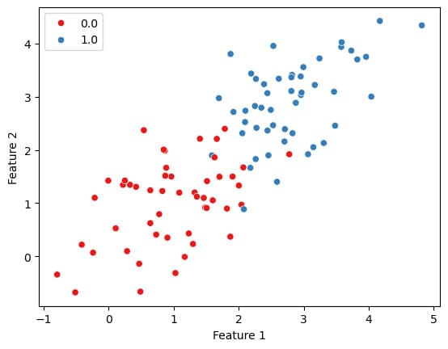

# Basic ML Models

This repository contains vectorized implementations of some basic machine learning models that I implemented as a form of practice while I was learning PyTorch. These models are made from scratch in PyTorch by creating weight and bias matrices in classes derived from `torch.nn.Module`.

List of models:

1. [Neural Network](#neural-network)
2. [Logistic Regression](#logistic-regression)
3. [Linear Regression](#linear-regression)

## Neural Network

### Model

Implemented a generic MLP neural network by extending `torch.nn.Module` such that it can take input dimensions, output dimensions and an array of hidden layer dimensions to generate weights and biases accordingly.

Link to notebook: [mlp-neural-net.ipynb](./neural-network/mlp-neural-net.ipynb)

**To create a model object, pass the input dims, output dims and hidden layer structure as parameters:**

```python
# Get a sample batch to get shapes for creating model
sample_batch_data, sample_batch_label = next(iter(train_data_loader))
data_shape = sample_batch_data.shape
target_shape = sample_batch_label.shape

# Define hidden layer structure
hidden_layers = [512, 512]
```
```python
# Create model object
model = MLPModel(data_shape, target_shape, hidden_layers)
model.to(device)
```

**Model object:**
```
>>> model
MLPModel(
  (weights): ParameterList(
      (0): Parameter containing: [torch.float32 of size 784x512 (cuda:0)]
      (1): Parameter containing: [torch.float32 of size 512x512 (cuda:0)]
      (2): Parameter containing: [torch.float32 of size 512x10 (cuda:0)]
  )
  (biases): ParameterList(
      (0): Parameter containing: [torch.float32 of size 1x512 (cuda:0)]
      (1): Parameter containing: [torch.float32 of size 1x512 (cuda:0)]
      (2): Parameter containing: [torch.float32 of size 1x10 (cuda:0)]
  )
)
```

### Dataset
Used [FashionMNIST dataset](https://pytorch.org/vision/stable/generated/torchvision.datasets.FashionMNIST.html) for testing the neural network implementation. Sample from the dataset:


Loss and accuracy curves:

  

## Logistic Regression

### Model

Implemented a subclass of `torch.nn.Module` with a 1-dimensional weight matrix and a scalar bias value.

Link to notebook: [logistic-regression.ipynb](./logistic-regression/logistic-regression.ipynb)

```python
# Create model
input_shape = next(iter(train_dataloader))[0].shape
model = LogisticRegressionModel(input_shape)
```

### Dataset

Generated dataset with 2 feature containing random values using `numpy` and target by using the generated features:



Model output after training:

 

## Linear Regression

### Model

Implemented a subclass of `torch.nn.Module` with a 1-dimensional weight matrix and a scalar bias value.

Link to notebook: [linear-regression.ipynb](./linear-regression/linear-regression.ipynb)

### Dataset

Generated dataset with only 1 feature containing random values using `numpy` and target by using the generated feature with a linear equation:


Model output after training:


